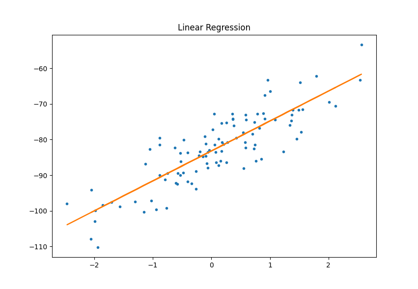

# skforget

Personal implementation of different machine learning algorithms from scratch. Long term goal is to learn more about the inner working of the different models and to recreate most features from sklearn without using any dependencies from third-party modules.

## Quick Start

### Linear Regression

```python
import skforget as skf

X, Y = skf.make_regression()

reg = skf.LinearRegression()
reg.fit(X, Y)
Y_pred = reg.predict(X)
```


